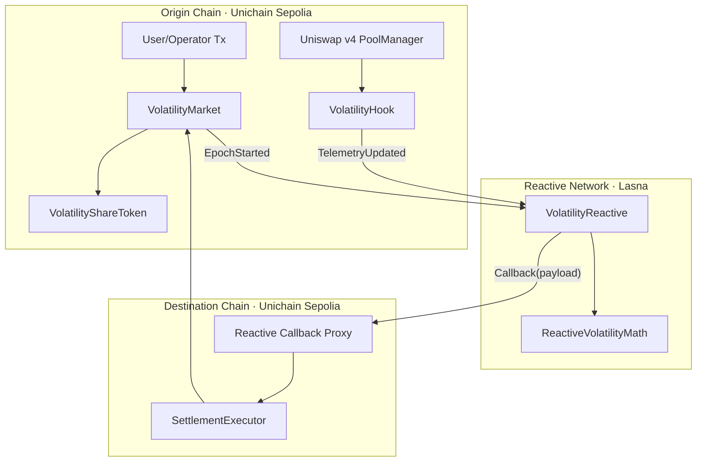
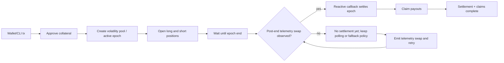
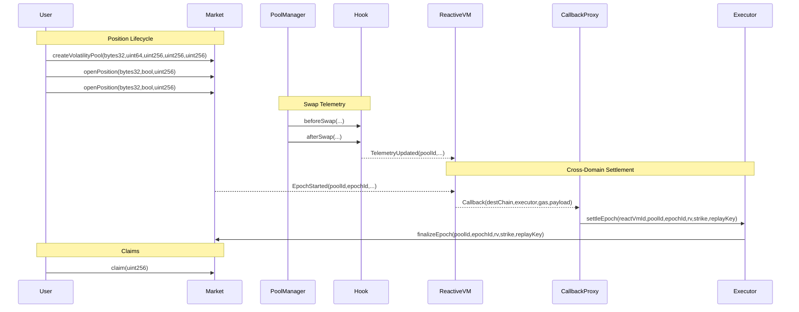
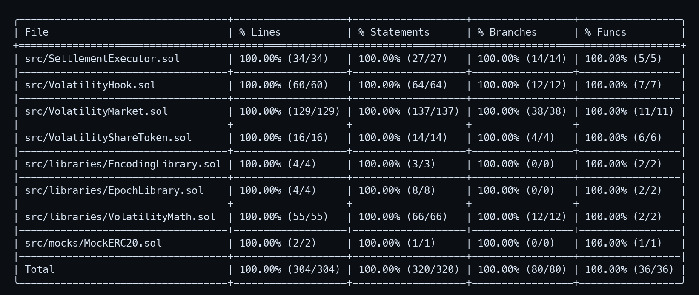

# Volatility Futures AMM (VFA Hook)
**Built on Uniswap v4 × Reactive Network · Deployed on Unichain Sepolia × Reactive Lasna**
_Targeting: Uniswap Foundation Prize · Unichain Prize · Reactive Network Prize_

> A volatility derivatives primitive that lets users trade long/short volatility exposure from Uniswap v4 swap telemetry, with Reactive Network callback settlement into epoch-based onchain payouts.


## The Problem

A volatility seller LPing a concentrated range can be synthetically short gamma without explicitly choosing that risk, while a protocol treasury using spot-only pools cannot directly hedge variance risk. In a concrete failure sequence, a sharp two-way market move creates elevated realized variance, concentrated liquidity is repeatedly crossed, and the treasury’s LP inventory decays relative to a variance-neutral benchmark. The actor is not malicious; the mechanism fails because spot AMMs settle directional inventory, not explicit volatility exposure, and the capital impact appears as persistent underperformance and forced rebalance losses.

At the protocol layer, legacy v3-style execution encodes static pool behavior at pool creation and does not let developers introduce hook-time telemetry transforms or per-swap risk accounting at the EVM call boundary. A pool can quote and clear swaps, but it does not natively maintain deterministic realized-volatility state that downstream contracts can settle against. The consequence is that protocols either import offchain volatility feeds or approximate volatility with ad hoc keeper processes, both of which add trust and latency.

At the settlement layer, cross-domain automation often breaks on authenticity and replay boundaries. Without strict callback authentication and epoch idempotency, one stale message or duplicated payload can cause double settlement attempts, inconsistent payout accounting, or manual intervention. In high-volatility intervals this operational gap compounds quickly, because the period with highest user demand is also where settlement correctness is least tolerant to ambiguity.

At current DeFi scale, where aggregate locked capital and weekly DEX turnover are in the tens to hundreds of billions of dollars, even small volatility-pricing inefficiencies propagate into material PnL leakage for LPs, treasuries, and structured-product protocols.

## The Solution

The core insight is to treat realized volatility as a first-class onchain settlement variable, computed from deterministic swap telemetry and settled in epochs exactly like a financial contract.

Users deposit collateral and open long-vol or short-vol positions against a pool-specific epoch. During the epoch, Uniswap v4 swap flow updates telemetry counters, and after epoch end the settlement path uses authenticated callback execution to finalize realized volatility and compute pro-rata payouts. A user gets deterministic settlement semantics: one epoch, one finalization, one claim path per position.

At the EVM level, `VolatilityHook` implements v4 swap hooks and stores cumulative tick/volume telemetry keyed by `PoolId`; `VolatilityReactive` subscribes to `TelemetryUpdated` and `EpochStarted` logs and emits a `Callback(...)` payload; `SettlementExecutor` verifies callback proxy sender plus expected ReactVM identity before forwarding to `VolatilityMarket.finalizeEpoch(...)`; and `VolatilityMarket` computes payout-per-share and mints/burns ERC1155 side tokens. The model is dual-state by design: origin-chain market/telemetry state and Reactive VM aggregation state, bridged by authenticated callback payloads with replay keys.

INVARIANT: Unauthorized callback senders cannot settle epochs — verified by `SettlementExecutor.settleEpoch(address,bytes32,uint256,uint256,uint256,bytes32)`.  
INVARIANT: A replay key is processed at most once — verified by `SettlementExecutor.settleEpoch(address,bytes32,uint256,uint256,uint256,bytes32)` and `SettlementExecutor.settleEpochManual(bytes32,uint256,uint256,uint256,bytes32)`.  
INVARIANT: Epoch payout computation is bounded and idempotent — verified by `VolatilityMarket.finalizeEpoch(bytes32,uint256,uint256,uint256,bytes32)`.

## Architecture

### Component Overview

```text
VFA-Hook
├─ contracts/src
│  ├─ VolatilityHook.sol            # Uniswap v4 hook; emits deterministic telemetry per swap
│  ├─ VolatilityMarket.sol          # Epoch lifecycle, position accounting, payout settlement
│  ├─ SettlementExecutor.sol        # Callback authentication + settlement forwarding
│  ├─ VolatilityShareToken.sol      # ERC1155 long/short epoch-side receipts
│  └─ libraries/*.sol               # Epoch, encoding, and volatility utilities
├─ reactive/src
│  ├─ VolatilityReactive.sol        # Reactive subscriber; computes epoch vol; emits callback payload
│  └─ libraries/ReactiveVolatilityMath.sol
├─ scripts
│  ├─ bootstrap.sh                  # Reproducible dependency pinning (Uniswap pinset 3779387)
│  ├─ deploy_sepolia.sh             # Origin-chain deployment
│  ├─ deploy_reactive.sh            # Reactive deployment + subscription init
│  └─ demo_testnet_live.sh          # End-to-end live proof script
└─ docs
   ├─ architecture.md
   ├─ deployment.md
   ├─ security.md
   ├─ testing.md
   └─ demo.md
```

### Architecture Flow (Subgraphs)



### User Perspective Flow



### Interaction Sequence



## Core Contracts & Components

### VolatilityHook

`VolatilityHook` exists to transform raw Uniswap v4 swap flow into deterministic volatility telemetry that can be settled later without offchain price feeds. It is separated from market accounting so pool-level telemetry logic can remain tightly scoped to hook permissions and `PoolManager` callbacks.

The critical functions are `function getHookPermissions() public pure override returns (Hooks.Permissions memory)`, `function getTelemetry(bytes32 poolId) external view returns (Telemetry memory)`, `function _beforeSwap(address, PoolKey calldata key, IPoolManager.SwapParams calldata params, bytes calldata) internal override returns (bytes4, BeforeSwapDelta, uint24)`, and `function _afterSwap(address, PoolKey calldata key, IPoolManager.SwapParams calldata, BalanceDelta, bytes calldata) internal override returns (bytes4, int128)`. The hook records pre-swap tick, measures volume threshold compliance, clamps extreme single-step tick deltas, and emits `TelemetryUpdated`.

It owns `mapping(bytes32 => Telemetry) telemetryByPool`, `mapping(bytes32 => int24) pendingTickBeforeSwap`, and `mapping(bytes32 => uint256) pendingSwapVolume` plus immutable parameters `minSwapVolume` and `maxTickDelta`. The `Telemetry` struct persists cumulative absolute/squared tick delta, cumulative volume, swap count, spike score, EMA, and last update metadata.

Its trust boundary is enforced by `BaseHook`: only `PoolManager` can invoke hook entrypoints. Unauthorized callers cannot reach `_beforeSwap`/`_afterSwap`; at the routing layer, swaps that do not satisfy min notional update skip with `TelemetrySkipped`, limiting dust-driven manipulation. Upstream it depends on canonical v4 `PoolKey`/`PoolId`; downstream it exposes event data consumed by `VolatilityReactive`.

### VolatilityMarket

`VolatilityMarket` is the settlement ledger for the product. It owns pool configuration, epoch lifecycle, position inventory, and payout-per-share accounting. It is intentionally separate from callback authentication so economic state and trust-policy state cannot be conflated.

Its critical interfaces are `function createVolatilityPool(bytes32,uint64,uint256,uint256,uint256) external`, `function openPosition(bytes32,bool,uint256) external nonReentrant returns (uint256)`, `function closePosition(uint256) external nonReentrant`, `function finalizeEpoch(bytes32,uint256,uint256,uint256,bytes32) external onlySettlementExecutor nonReentrant`, `function claim(uint256) external nonReentrant`, and `function isEpochSettled(bytes32,uint256) external view returns (bool)`. Pool creation starts epoch `1` immediately; opening a position transfers collateral and mints side-specific ERC1155 receipts; finalization computes parimutuel payout-per-share and starts the next epoch.

It owns `mapping(bytes32 => VolatilityPool) volatilityPools`, `mapping(bytes32 => mapping(uint256 => Epoch)) epochs`, `mapping(uint256 => Position) positions`, and per-epoch payout maps `longPayoutPerShare` and `shortPayoutPerShare`. Key globals include `settlementExecutor`, `nextPositionId`, `ONE`, and `MAX_REALIZED_VOLATILITY`.

Its trust boundary is explicit: only `settlementExecutor` may call `finalizeEpoch`, owner-only methods configure pool creation and executor rotation, and unauthorized calls revert with custom errors (`NotSettlementExecutor`, `InvalidPositionOwner`, `UnknownPool`, `InvalidEpoch`, and others). Upstream it receives authenticated settlement data from `SettlementExecutor`; downstream it mints/burns `VolatilityShareToken` and transfers ERC20 collateral.

### SettlementExecutor

`SettlementExecutor` is the callback authenticity gate and replay barrier. It exists as a distinct module so cross-domain trust checks can evolve independently from market math and position accounting.

The critical functions are `function settleEpoch(address reactVmId, bytes32 poolId, uint256 epochId, uint256 realizedVolatility, uint256 settlementPrice, bytes32 replayKey) external nonReentrant`, `function settleEpochManual(bytes32,uint256,uint256,uint256,bytes32) external onlyOwner nonReentrant`, `function setCallbackProxy(address) external onlyOwner`, and `function setExpectedReactVmId(address) external onlyOwner`. `settleEpoch` validates sender and ReactVM identity, enforces replay-key idempotency, and then forwards to `market.finalizeEpoch(...)`.

It owns immutable `market`, mutable `callbackProxy`, mutable `expectedReactVmId`, and `mapping(bytes32 => bool) processedReplayKeys`. It also extends Reactive payer plumbing through `AbstractPayer` to support callback debt settlement (`pay(uint256)`/`coverDebt()` path).

Its trust boundary is two-factor onchain validation: `msg.sender` must equal `callbackProxy` and payload arg `reactVmId` must equal `expectedReactVmId`; otherwise it reverts with `UnauthorizedCallbackProxy` or `InvalidReactVmId`. Upstream it receives cross-domain callback calls; downstream it is the only authorized caller to market finalization.

### VolatilityReactive

`VolatilityReactive` is the reactive VM-side state machine that subscribes to origin logs, maintains per-pool telemetry snapshots, detects epoch completion, computes realized volatility, and emits callback payloads.

Its critical functions are `function initializeSubscriptions() external rnOnly onlyOwner` and `function react(IReactive.LogRecord calldata log) external vmOnly`. Subscription setup calls Reactive system `subscribe(...)` for both `TelemetryUpdated` and `EpochStarted` topics. `react(...)` dispatches to `_handleEpochStarted` and `_handleTelemetry`, then `_maybeEmitSettlementCallback(...)` computes epoch deltas and emits `Callback(...)` with settlement payload where the first argument is intentionally a placeholder address, later overwritten with ReactVM ID by callback infrastructure.

It owns immutable routing/config values (`originChainId`, `destinationChainId`, `originHook`, `originMarket`, `settlementExecutor`, `callbackGasLimit`), model params (`ReactiveVolatilityMath.Params`), and per-pool state maps `latestTelemetry` and `trackedEpochs`. `EpochState.callbackSent` enforces idempotent callback emission per active epoch.

Its trust boundary is split by Reactive execution context: `vmOnly` for `react(...)`, `rnOnly` for owner-triggered subscription initialization, and immutable destination routing for callback target contract. Upstream it consumes hook and market events; downstream it emits authenticated callback events that `SettlementExecutor` validates again on destination chain.

### VolatilityShareToken

`VolatilityShareToken` is the ERC1155 position-receipt layer for epoch-side exposure (`long` or `short`). It is isolated so transfer policy and mint/burn authority can be changed without modifying settlement logic.

The critical functions are `function setMarket(address newMarket) external onlyOwner`, `function setTransfersEnabled(bool enabled) external onlyOwner`, `function mint(address to, uint256 id, uint256 amount) external onlyMarket`, and `function burn(address from, uint256 id, uint256 amount) external onlyMarket`. IDs are deterministic from `poolId + epochId + side` via `EncodingLibrary.shareTokenId(...)`.

It owns `market` and `transfersEnabled`; unauthorized mint/burn calls revert with `OnlyMarket`, and peer-to-peer transfers revert with `TransfersDisabled` unless owner enables transfers. Upstream it is called by `VolatilityMarket`; downstream it serves as the claim-time burn proof.

### Data Flow

In the primary flow, an operator calls `VolatilityMarket.createVolatilityPool(bytes32,uint64,uint256,uint256,uint256)`, which writes `volatilityPools[poolId]`, initializes `epochs[poolId][1]`, and emits `VolatilityPoolCreated` plus `EpochStarted`. Users then call `openPosition(bytes32,bool,uint256)`, which validates pool bounds and epoch activity, writes `positions[positionId]`, mutates epoch totals, transfers collateral in, and mints ERC1155 via `VolatilityShareToken.mint(address,uint256,uint256)`.

Swaps on the linked v4 pool invoke `VolatilityHook._beforeSwap(...)` and `_afterSwap(...)`, mutating `pendingTickBeforeSwap`, `pendingSwapVolume`, and `telemetryByPool[poolId]`; when accepted, `TelemetryUpdated` is emitted with cumulative counters. `VolatilityReactive.react(IReactive.LogRecord)` consumes both `EpochStarted` and `TelemetryUpdated`, writes `trackedEpochs[poolId]` and `latestTelemetry[poolId]`, computes per-epoch deltas, and emits `Callback(...)` once epoch end is observed.

Reactive callback proxy calls `SettlementExecutor.settleEpoch(address,bytes32,uint256,uint256,uint256,bytes32)`. The executor validates sender and ReactVM ID, writes `processedReplayKeys[replayKey] = true`, and calls `VolatilityMarket.finalizeEpoch(...)`. Finalization writes `epochs[poolId][epochId].settled`, realized volatility, payout-per-share maps, increments `currentEpochId`, and starts the next epoch.

Finally, each user calls `VolatilityMarket.claim(uint256)`, which validates ownership and settled epoch state, computes payout using `longPayoutPerShare` or `shortPayoutPerShare`, burns share tokens via `VolatilityShareToken.burn(address,uint256,uint256)`, transfers collateral out, and marks position `closed/claimed`.

## Epoch Lifecycle Model

| Stage | Entry Condition | Key State Writes | Exit Condition |
|---|---|---|---|
| `PoolCreated` | Owner calls `createVolatilityPool(...)` | `volatilityPools[poolId]`, `epochs[poolId][1]` | Epoch 1 active |
| `EpochActive` | `EpochLibrary.isActive(...) == true` | `positions`, `epoch.totalLong/totalShort` | `block.timestamp >= endTime` |
| `TelemetryAccumulating` | Swaps pass `minSwapVolume` filter | `telemetryByPool[poolId]` cumulative counters | First post-end telemetry arrives |
| `CallbackPrepared` | Reactive sees ended epoch + telemetry | `trackedEpochs[poolId].callbackSent = true` | Callback proxy executes settlement tx |
| `EpochSettled` | Executor validates callback and forwards | `epochs[poolId][epochId].settled`, payout maps | Users can claim |
| `ClaimClosed` | User calls `claim(positionId)` | `positions[positionId].closed/claimed` | Position cannot be reused |

`finalizeEpoch(...)` is intentionally idempotent for replay safety. If a replay key has already been processed, settlement returns early without mutating payout state twice.

## Deployed Contracts

### Unichain Sepolia (chainId: 1301)

| Contract | Address |
|---|---|
| PoolManager | [0x00b036b58a818b1bc34d502d3fe730db729e62ac](https://sepolia.uniscan.xyz/address/0x00b036b58a818b1bc34d502d3fe730db729e62ac) |
| Callback Proxy | [0x9299472A6399Fd1027ebF067571Eb3e3D7837FC4](https://sepolia.uniscan.xyz/address/0x9299472A6399Fd1027ebF067571Eb3e3D7837FC4) |
| VolatilityHook | [0xf52Fad28835f70d8bF201964a916C809F54900c0](https://sepolia.uniscan.xyz/address/0xf52Fad28835f70d8bF201964a916C809F54900c0) |
| VolatilityShareToken | [0x6b1d7224D4464A41679E7a6F3dc5817B6cBbE612](https://sepolia.uniscan.xyz/address/0x6b1d7224D4464A41679E7a6F3dc5817B6cBbE612) |
| VolatilityMarket | [0x83F4494618ea8831682b827dC40Cc33E356960b1](https://sepolia.uniscan.xyz/address/0x83F4494618ea8831682b827dC40Cc33E356960b1) |
| SettlementExecutor | [0xc99A0C129C6177AC0f280fb4DBa7dc7Cb7988f24](https://sepolia.uniscan.xyz/address/0xc99A0C129C6177AC0f280fb4DBa7dc7Cb7988f24) |
| Collateral Token | [0xd0019D1cA98C5751B3D82cf35a1f6bD665CeB6f6](https://sepolia.uniscan.xyz/address/0xd0019D1cA98C5751B3D82cf35a1f6bD665CeB6f6) |
| Hookmate Swap Router | [0x9cD2b0a732dd5e023a5539921e0FD1c30E198Dba](https://sepolia.uniscan.xyz/address/0x9cD2b0a732dd5e023a5539921e0FD1c30E198Dba) |
| Telemetry Token0 | [0x3E358F7992C51b2e2A89cF979ECd5c2e5A107d60](https://sepolia.uniscan.xyz/address/0x3E358F7992C51b2e2A89cF979ECd5c2e5A107d60) |
| Telemetry Token1 | [0xb87A417603e55520c60718166482CAcd6c669335](https://sepolia.uniscan.xyz/address/0xb87A417603e55520c60718166482CAcd6c669335) |

### Reactive Lasna (chainId: 5318007)

| Contract | Address |
|---|---|
| Reactive System Contract | [0x0000000000000000000000000000000000fffFfF](https://lasna.reactscan.net/address/0x0000000000000000000000000000000000fffFfF) |
| VolatilityReactive | [0x81018ae79B94E4A9b5bB3c7f5f6bE97DEdA9E858](https://lasna.reactscan.net/address/0x81018ae79B94E4A9b5bB3c7f5f6bE97DEdA9E858) |

## Live Demo Evidence

Demo run date: **2026-03-18 (UTC)**.

### Phase 1 — Position Lifecycle Start (Unichain Sepolia)

This phase proves that collateral custody, pool initialization, and epoch start are onchain and deterministic. First, collateral allowance is granted to `VolatilityMarket` so position opens can pull funds; then the operator creates a volatility pool and epoch 1 begins with configured strike/baseline. The approval transaction calls ERC20 `approve(...)` and should show allowance change for market spender at [0xacec8ba6a6a6c0a9b73ebdd465d4d6437bcd88a998e31ac4e3015a1b17892bf7](https://sepolia.uniscan.xyz/tx/0xacec8ba6a6a6c0a9b73ebdd465d4d6437bcd88a998e31ac4e3015a1b17892bf7). The pool creation transaction calls `VolatilityMarket.createVolatilityPool(bytes32,uint64,uint256,uint256,uint256)` and should emit `VolatilityPoolCreated` and `EpochStarted` at [0xb45b3b19d95af891eab2075e1028d39e885f56a5ed5d36faaad98c737a56430f](https://sepolia.uniscan.xyz/tx/0xb45b3b19d95af891eab2075e1028d39e885f56a5ed5d36faaad98c737a56430f). This phase proves epoch state can be bootstrapped without offchain actors.

### Phase 2 — Position Entry (Unichain Sepolia)

This phase proves both sides of the volatility market can open positions against the same active epoch. The long-side open calls `VolatilityMarket.openPosition(bytes32,bool,uint256)` with `isLong=true`, writes position state, increments `totalLong`, and mints long share token at [0x474265f1b6802f17dc5a525c99e8a4a6fe9f7295e815990f48a036637762d48c](https://sepolia.uniscan.xyz/tx/0x474265f1b6802f17dc5a525c99e8a4a6fe9f7295e815990f48a036637762d48c). The short-side open executes the same function with `isLong=false`, updates `totalShort`, and mints short share token at [0x0d62552d326b6ae78582dcaee231f4ac2c648bdf74513330c37101020a137229](https://sepolia.uniscan.xyz/tx/0x0d62552d326b6ae78582dcaee231f4ac2c648bdf74513330c37101020a137229). In both traces a verifier should confirm `PositionOpened` event parameters and ERC1155 mint events with deterministic token IDs. This phase proves balanced long/short exposure can be opened under one epoch state.

### Phase 3 — Post-Epoch Telemetry Trigger (Unichain Sepolia)

This phase proves settlement input data is produced from actual hooked swap flow after epoch end. The telemetry token approval transaction authorizes router spend at [0xf3fe9a0f28bae6c9f19f4dd7b103c0b734f38bc1f661a1893933cad3e47544bb](https://sepolia.uniscan.xyz/tx/0xf3fe9a0f28bae6c9f19f4dd7b103c0b734f38bc1f661a1893933cad3e47544bb). The subsequent router swap transaction executes against the hooked pool at [0x29ae12c66ee226604dd713a661fab2274e6cb86eaa9f040ddd8c44e4a51f4542](https://sepolia.uniscan.xyz/tx/0x29ae12c66ee226604dd713a661fab2274e6cb86eaa9f040ddd8c44e4a51f4542), and a verifier should inspect emitted `TelemetryUpdated(poolId,...)` from `VolatilityHook` plus updated cumulative fields. This phase proves deterministic volatility inputs are generated by onchain swaps, not offchain feeds.

### Phase 4 — Reactive Callback Settlement (Unichain Sepolia)

This phase proves authenticated callback settlement and replay-safe forwarding. Callback proxy execution reaches `SettlementExecutor.settleEpoch(address,bytes32,uint256,uint256,uint256,bytes32)` and forwards to `VolatilityMarket.finalizeEpoch(...)` in [0x239cc134b9bdffd2522b55a4fee84003d217fd9c2c38667b63411bba83d01105](https://sepolia.uniscan.xyz/tx/0x239cc134b9bdffd2522b55a4fee84003d217fd9c2c38667b63411bba83d01105). A verifier should inspect that `msg.sender` is callback proxy, the overwritten first argument equals expected ReactVM ID, `EpochSettlementForwarded` is emitted, and `SettlementExecuted` is emitted once for the replay key. This phase proves callback authenticity and idempotent epoch finalization.

### Phase 5 — Claims (Unichain Sepolia)

This phase proves post-settlement user redemption is deterministic and side-aware. The long claim calls `VolatilityMarket.claim(uint256)` and closes the long receipt at [0x0d6a139d1b3538a1fc39f247a8d75304d531352ff9be5d58b8b288f165eb80ad](https://sepolia.uniscan.xyz/tx/0x0d6a139d1b3538a1fc39f247a8d75304d531352ff9be5d58b8b288f165eb80ad). The short claim executes the same path for short receipt at [0x12125a5113bb098efa875f03cd67e5aa160c634a3a78db8cfafc11ec7d21677e](https://sepolia.uniscan.xyz/tx/0x12125a5113bb098efa875f03cd67e5aa160c634a3a78db8cfafc11ec7d21677e). In both traces a verifier should inspect `PositionClosed(..., settledClose=true)` and ERC1155 burn events. This phase proves settled state can be redeemed exactly once per position.

The complete proof chain demonstrates that swap telemetry, reactive callback routing, authenticated settlement, and user claim finality are all represented as verifiable, linked onchain artifacts without offchain oracle dependency.

## Running the Demo

```bash
# Install deterministic dependencies and enforce Uniswap pinset
./scripts/bootstrap.sh

# Run full live testnet demo using existing deployed addresses
SETTLEMENT_MODE=reactive ALLOW_MANUAL_FALLBACK=0 make demo-testnet-live
```

```bash
# Deploy origin-chain contracts (Unichain Sepolia)
make deploy-sepolia

# Deploy reactive contract and initialize subscriptions (Lasna)
make deploy-reactive

# Run lifecycle-only live demo with strict reactive settlement
USE_EXISTING_DEPLOYMENTS=1 SETTLEMENT_MODE=reactive make demo-testnet-live
```

```bash
# Build and test locally
make test

# Run local deterministic lifecycle demonstration
make demo-local
```

## Test Coverage

```text
LINES:       304/304 (100.00%)
STATEMENTS:  320/320 (100.00%)
BRANCHES:     80/80 (100.00%)
FUNCTIONS:    36/36 (100.00%)
```

```bash
# Reproduce full coverage for both Foundry projects
make coverage
```

Coverage output screenshot (from `cd contracts && forge coverage --offline --exclude-tests --no-match-coverage 'script|test|deps'`):



- Unit tests: pool, epoch, payout, access-control, encoding logic.
- Fuzz tests: replay key uniqueness, payout conservation, math stability.
- Integration tests: full lifecycle across hook, market, executor, claims.
- Edge-case tests: low-volume suppression and tick-delta clamp behavior.
- Reactive tests: subscription lifecycle, callback build, idempotent emit.

## Repository Structure

```text
contracts/
  src/
  test/
reactive/
  src/
  test/
scripts/
docs/
```

## Documentation Index

| Doc | Description |
|---|---|
| `docs/overview.md` | High-level protocol intent and scope. |
| `docs/architecture.md` | System components and call-path diagrams. |
| `docs/volatility-model.md` | Deterministic volatility math and anti-gaming filters. |
| `docs/security.md` | Threat model, mitigations, and residual risks. |
| `docs/deployment.md` | Network deployment requirements and commands. |
| `docs/demo.md` | End-to-end demo procedure and evidence expectations. |
| `docs/api.md` | Contract events/functions and integration-facing interface notes. |
| `docs/testing.md` | Test commands, coverage policy, and suite intent. |
| `docs/deployed-addresses.md` | Human-readable deployed contract addresses and tx links. |
| `docs/deployments.testnet.json` | Machine-readable deployments and lifecycle tx artifacts. |

## Key Design Decisions

**Why compute realized volatility from tick telemetry instead of oracle feeds?**  
The design requires deterministic settlement from data already committed by swap execution. Oracle integration would add freshness assumptions and governance risk at exactly the point where epoch payouts need strict reproducibility. Tick/volume counters provide O(1) update cost and auditability.

**Why isolate callback authentication in SettlementExecutor?**  
Cross-domain trust checks are a separate concern from economic accounting. By isolating proxy and ReactVM validation in one module, the market contract remains simpler and easier to audit for payout correctness while executor policy can rotate callback routes without rewriting settlement math.

**Why enforce replay-key idempotency at executor and settled-state checks at market?**  
Replay resistance is strongest when both boundary and core state layers are defensive. Executor-level replay-key tracking blocks duplicate payload forwarding; market-level settled checks ensure even a forwarded duplicate cannot mutate payout state twice.

**Why use ERC1155 receipts for long/short epoch exposure?**  
The position side and epoch are naturally encoded as deterministic token IDs and fit multi-asset accounting patterns. ERC1155 also reduces per-position contract complexity while preserving explicit burn-on-claim semantics.

## Roadmap

- [ ] Add configurable protocol fee module with claim-time fee accounting.
- [ ] Add explicit emergency pause mode with bounded owner authority.
- [ ] Expand adversarial economic simulation tests for extreme liquidity shocks.
- [ ] Add formal property checks for payout conservation and replay safety.
- [ ] Add multi-collateral market factory with parameter governance.
- [ ] Add production monitoring pipeline for callback debt and settlement latency.

## License

MIT
