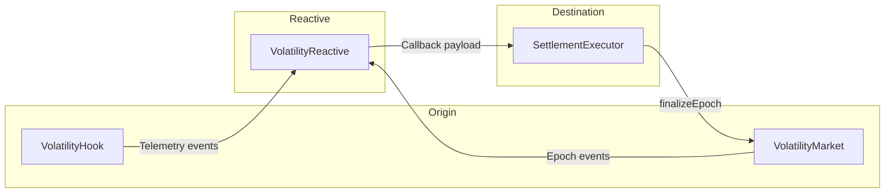
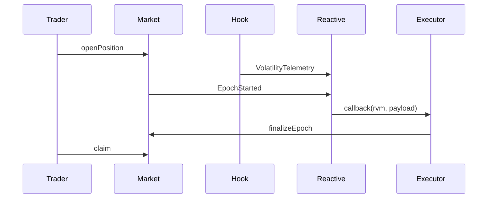
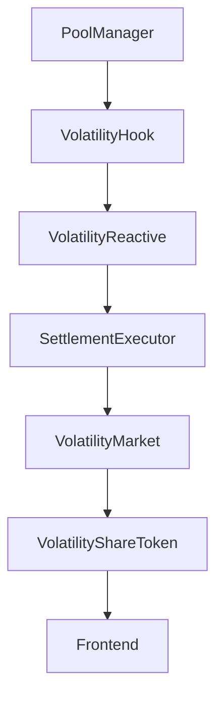

# Architecture

## Components

- `contracts/src/VolatilityHook.sol`
- `contracts/src/VolatilityMarket.sol`
- `contracts/src/SettlementExecutor.sol`
- `reactive/src/VolatilityReactive.sol`
- `frontend/` dashboard

## System Diagram

## Sequence

## Component Interactions

## Key Constraints

- Hook entrypoints only callable by `PoolManager`.
- Hook permission bits must match deployment address bits.
- Reactive callback first argument is overwritten with ReactVM ID.
- Executor must validate callback proxy + ReactVM ID.
